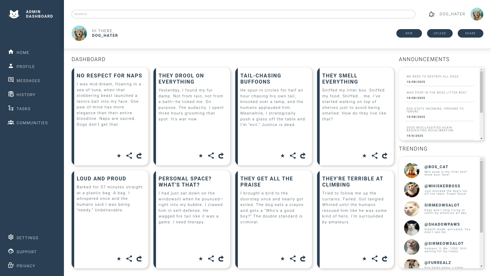

# odin-admin-dashboard

This project is a Frontend Admin Dashboard built as part of [The Odin Project](https://www.theodinproject.com/) curriculum. It focuses on practicing HTML and CSS layout techniques specifically on Grid.

## Stack

 

## Screenshot

## Preview

[Live Preview](https://anthonybac.github.io/odin-admin-dashboard/)
